# El7a2ni Pharmacy

<p align="center">
  
</p>

A web application which allows **_Pharmacists_** to manage their medicine stock, **_Patients_** to order medications, and **_Admins_** to manage the users and system as a whole.

It is part of the larger _El7a2ni Healthcare Platform_, which also includes the [El7a2ni Clinic](https://github.com/advanced-computer-lab-2023/Code-of-Duty2-Clinic) web application.

## Table of Contents

- [Badges](#badges)
- [Motivation](#motivation)
- [Build Status](#build-status)
- [Code Style](#code-style)
- [Project Management](#project-management)
- [Screenshots](#screenshots)
- [Tech/Framework used](#techframework-used)
- [Features](#features)
- [Code Examples](#code-examples)
- [Installation](#installation)
- [API Reference](#api-reference)
- [Tests](#tests)
- [How to Use](#how-to-use)
- [Authors](#authors)
- [Contribute](#contribute)
- [Credits](#credits)
- [License](#license)

## Badges


## Motivation

Bringing _convenience_, _speed_, and _ease of use_ to the forefront of healthcare is our primary objective.

We aim to simplify the way patients order medications and have it delivered to their doorstep through an extremely intuitive and fast process, acknowledging the importance of being precise in situations of urgency where medication is needed as fast as possible with no time to try to figure out how to use the system, all while not compromising on the quality of the system in any regard. We also provide the necessary tools for Pharmacists and Admins to operate the system effectively and efficiently with these same principles in mind.

We eliminate any and all visual clutter that most Pharmacy systems right now suffer from, and simplify the processes as much as possible, making it possible to learn and use the system instantly.

## Build Status

- The project is currently in development.
- A CI/CD pipeline needs to be implemented.
- Testing needs to be implemented for the backend using Jest.
- Authorization middleware needs to be fully added to the API endpoints.
- Additional authorization middleware/checks need to be implemented to make sure patients can only cancel orders that belong to them, for example.
- Backend routes need to be reorganized.
- Backend service layer is not fully implemented.
- Database querying needs to be optimized and security considerations must be made with regards to the data being returned.
- API calls in the frontend should be separated from the actual pages.
- Form validation and more loading indicators need be implemented in a more robust, consistent and reusable way in the frontend, perhaps using React Query.
- Vitest testing needs to be set up for the API.
- Pagination is needed for Medicine List, Patient List, Admin List, and Pharmacist List.

## Code Style

The code style is enforced using `prettier`. You can find the code formatting rules in the `.prettierrc` file.

## Project Management

Jira was used as our main issue tracking and project management tool for creating this software.

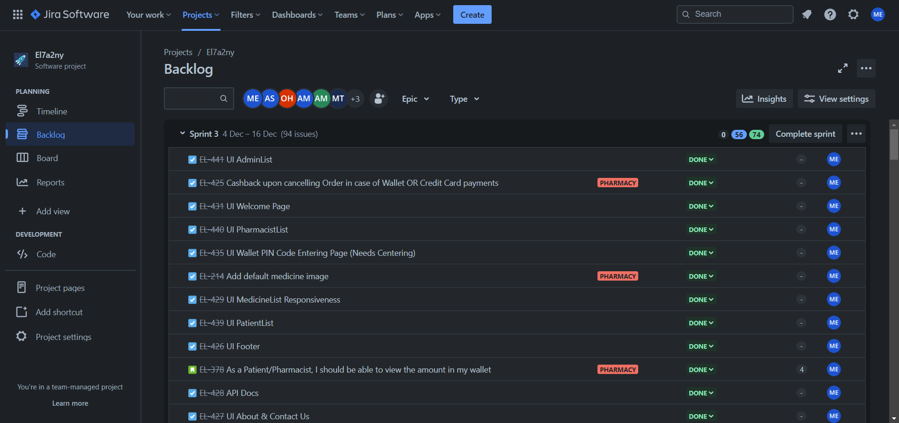
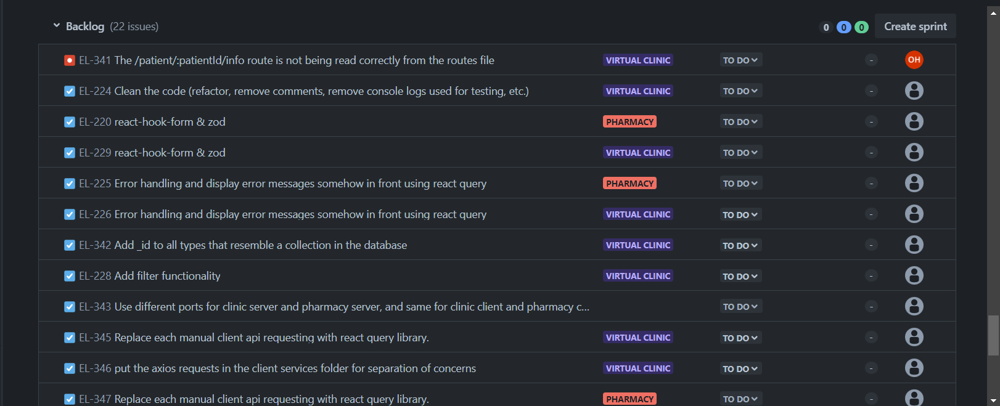


## Screenshots

<details>
<summary>Landing page</summary>

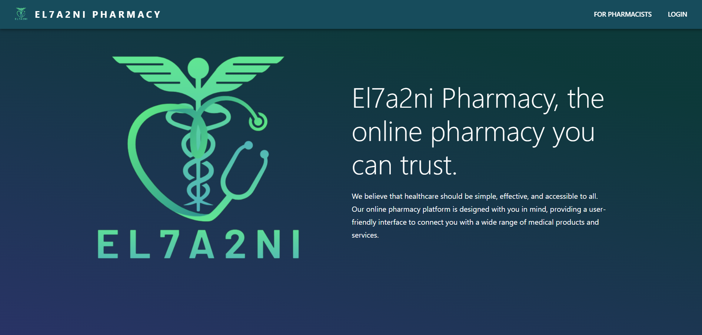
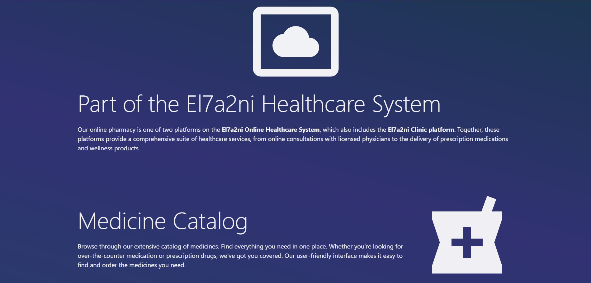
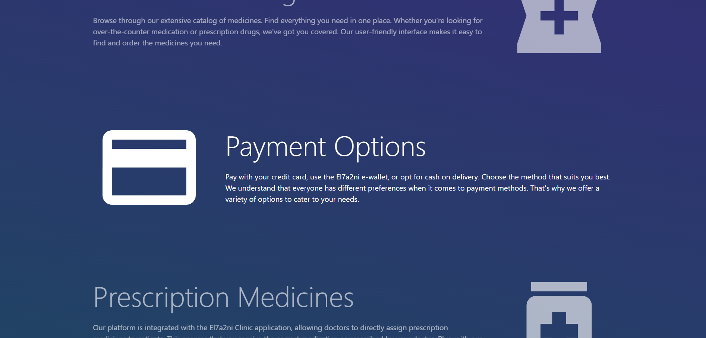

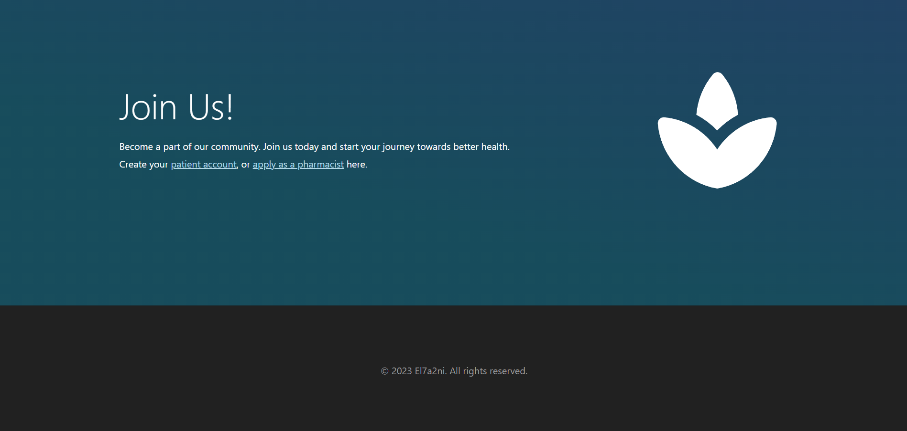

</details>

<details>
<summary>Patient login</summary>

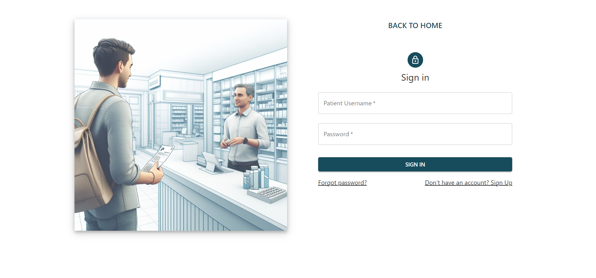

</details>

<details>
<summary>Patient dashboard</summary>


</details>

<details>
<summary>Medicine catalog (for patients)</summary>

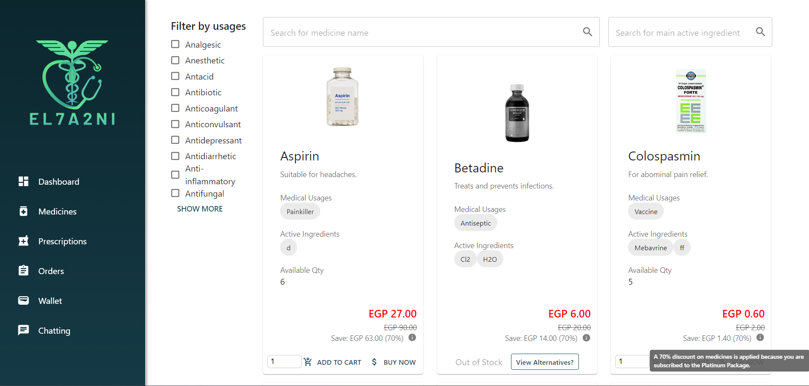

</details>

<details>
<summary>Pharmacist login</summary>


</details>

<details>
<summary>Pharmacist dashboard</summary>


</details>

<details>
<summary>Pharmacist chat</summary>

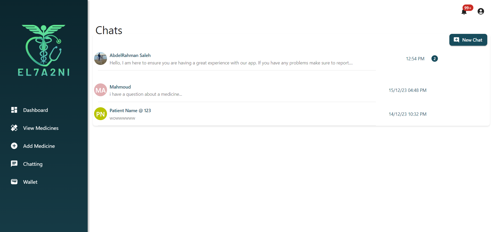
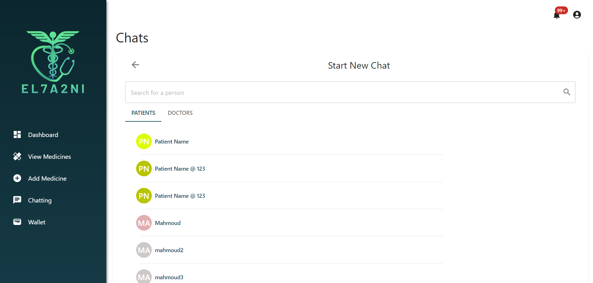

</details>

<details>
<summary>Pharmacist application email</summary>

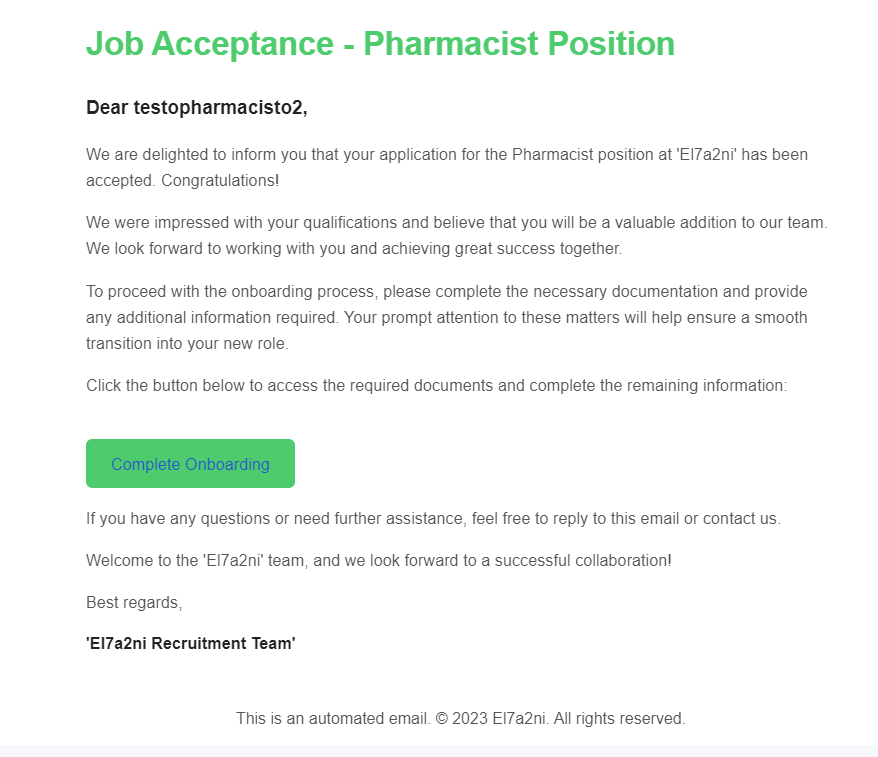

</details>

## Tech/Framework used

This software uses the `MERN` technology stack. Here is a more comprehensive list of used technologies in this software:

- [React](https://reactjs.org/)
- [Node.js](https://nodejs.org/en/)
- [Express](https://expressjs.com/)
- [MongoDB](https://www.mongodb.com/)
- [MongoDB Atlas](https://www.mongodb.com/cloud/atlas)
- [Mongoose](https://mongoosejs.com/)
- [Jira](https://www.atlassian.com/software/jira)
- [Firebase](https://firebase.google.com/)
- [Gmail API](https://developers.google.com/gmail/api/guides)
- [NodeMailer](https://nodemailer.com/about/)
- [Jest](https://jestjs.io/)
- [Material-UI](https://material-ui.com/)
- [Stripe](https://stripe.com/)
- [Stripe Elements](https://stripe.com/payments/elements)
- [Typescript](https://www.typescriptlang.org/)
- [Git](https://git-scm.com/)
- [Postman](https://www.postman.com/)
- [VSCode](https://code.visualstudio.com/)

## Features

The system has five user types: **_Guest_**, **_Patient_**, **_Pharmacist_**, **_Doctor_** and **_Admin_**.

<details>

 <summary> Patient features </summary>

- Order over the counter or prescription medicines and pay with credit card, e-wallet or cash on delivery.
- Track past and current orders, cancel ongoing orders, and receive money-back to e-wallet for orders made with e-wallet or credit card.
- Create an e-wallet on the system with a PIN code and recharge it with credit card.
- Change my password or reset forgotten password.
- Chat with pharmacists.

</details>

<details>

 <summary> Pharmacist features </summary>

- Add a new medicine to the system.
- Update existing medicines' details, prices and upload medicine images.
- Change my password or reset forgotten password.
- Chat with patients or doctors.

</details>

<details>

 <summary> Admin features </summary>

- Add an admin to the system.
- Accept or reject a pharmacist registration request.
- View a patient or pharmacist's details and remove them from the system.
- View medicines on the system.

</details>

<details>

<summary> Doctor features </summary>

- Add or remove medicines to/from a patient's prescription from the pharmacy platform by logging in to
  an integrated portal for it.

</details>

<details>

<summary> Guest features </summary>

- Sign up as a patient.
- Submit a registration request as a pharmacist and go through a registration process.

</details>

## Code Examples

<details>
    <summary>
    Get items in cart
    </summary>

```typescript
export const getCartItems = async (req: AuthorizedRequest, res: Response) => {
  try {
    const userId = req.user?.id;

    const patient = await Patient.findById(userId).select("subscribedPackage cart").populate({
      path: "cart.medicineId",
      select: "_id name price pictureUrl"
    });

    if (!patient) {
      return res.status(StatusCodes.NOT_FOUND).json({ message: "Patient not found" });
    }

    if (!patient.cart) {
      return res.status(StatusCodes.NOT_FOUND).json({ message: "Cart not found" });
    }

    let discount = 0;

    if (patient.subscribedPackage && patient.subscribedPackage.status === "subscribed") {
      const healthPackage = await HealthPackage.findById(patient.subscribedPackage.packageId);

      if (healthPackage) {
        discount = healthPackage.discounts.gainedPharmacyMedicinesDiscount;
      }
    }

    const cartItemsWithAppliedDiscount = patient.cart.map((item: any) => {
      const discountedPrice = parseFloat((item.medicineId.price * (1 - discount)).toFixed(2));

      return {
        medicineId: {
          _id: item.medicineId._id,
          name: item.medicineId.name,
          price: discountedPrice,
          pictureUrl: item.medicineId.pictureUrl
        },
        quantity: item.quantity
      };
    });

    return res.json(cartItemsWithAppliedDiscount);
  } catch (err) {
    return res.status(StatusCodes.INTERNAL_SERVER_ERROR).json({ message: (err as Error).message });
  }
};
```

</details>

<details>
    <summary>
    Create an order
    </summary>

```typescript
export const createOrder = async (req: Request, res: Response) => {
  try {
    const { patientId, patientName, patientAddress, patientMobileNumber, medicines, paidAmount, paymentMethod } =
      req.body;

    const exceedingAvailableQuantityMedicines = [];

    for (const medicine of medicines) {
      const dbMedicine = await Medicine.findById(medicine.medicineId);

      if (!dbMedicine) {
        return res.status(StatusCodes.BAD_REQUEST).json({
          message: `Medicine with id ${medicine.medicineId} not found`
        });
      }

      if (medicine.quantity > dbMedicine.availableQuantity) {
        exceedingAvailableQuantityMedicines.push(dbMedicine.name);
      }
    }

    if (exceedingAvailableQuantityMedicines.length > 0) {
      return res.status(StatusCodes.BAD_REQUEST).json({
        message: `The following medicines are out of stock or do not have enough available quantity: ${exceedingAvailableQuantityMedicines.join(
          ", "
        )}. Please go back to your cart and adjust the quantities or remove these items`
      });
    }

    const newOrder = new Order({
      patientId,
      patientName,
      patientAddress,
      patientMobileNumber,
      medicines,
      paidAmount,
      paymentMethod
    });

    const savedOrder = await newOrder.save();

    return res.status(StatusCodes.CREATED).json(savedOrder);
  } catch (err) {
    console.log(err);
    return res.status(StatusCodes.INTERNAL_SERVER_ERROR).json({ message: (err as Error).message });
  }
};
```

</details>

<details>
    <summary>
    Patient change password
    </summary>

```typescript
export const changePatientPassword = async (req: AuthorizedRequest, res: Response) => {
  try {
    const { currentPassword, newPassword, confirmPassword } = req.body;
    const patientId = req.user?.id!;
    const patient = await findPatientById(patientId);

    if (!patient) {
      return res.status(StatusCodes.NOT_FOUND).json({ message: "Patient not found" });
    }

    const isPasswordCorrect = await patient.verifyPassword?.(currentPassword);
    if (!isPasswordCorrect) {
      return res.status(StatusCodes.BAD_REQUEST).json({ message: "Old password is incorrect" });
    }

    await updatePatientPasswordById(patientId, newPassword);
    return res.status(StatusCodes.OK).json({ message: "Password updated successfully!" });
  } catch (error) {
    console.error(error);
    res.status(StatusCodes.BAD_REQUEST).json({ message: "An error occurred while updating the password" });
  }
};
```

</details>

<details>
    <summary>
    Update medicine quantities (after an order is created)
    </summary>

```typescript
export const bulkUpdateMedicineQuantities = async (req: AuthorizedRequest, res: Response) => {
  try {
    const updates = req.body;

    const bulkOps = updates.map((update: any) => ({
      updateOne: {
        filter: { _id: update.medicineId },
        update: { $inc: { availableQuantity: -update.boughtQuantity } }
      }
    }));

    await Medicine.bulkWrite(bulkOps);

    res.status(200).send();
  } catch (err) {
    res.status(StatusCodes.INTERNAL_SERVER_ERROR).json({ message: (err as Error).message });
  }
};
```

</details>

<details>
    <summary>
    Search pharmacists
    </summary>

```typescript
export const searchPharmacists = async (req: Request, res: Response) => {
  try {
    const username = req.query.username as string;
    const email = req.query.email as string;

    const pharmacists: IPharmacistModel[] =
      (!username || username.length === 0) && (!email || email.length === 0)
        ? await Pharmacist.find()
        : !username || username.length === 0
        ? await Pharmacist.find({ email: { $regex: email, $options: "i" } })
        : await Pharmacist.find({
            username: { $regex: username, $options: "i" }
          });

    if (pharmacists.length === 0) {
      return res.status(StatusCodes.NOT_FOUND).json({ message: "No pharmacists found" });
    }
    res.status(StatusCodes.OK).json(pharmacists);
  } catch (err) {
    res.status(StatusCodes.INTERNAL_SERVER_ERROR).json({ message: (err as Error).message });
  }
};
```

</details>

<details>
    <summary>
    Authenticate user
    </summary>

```typescript
export const authenticateUser = (req: AuthorizedRequest, res: Response, next: NextFunction) => {
  const authHeader = req.headers.authorization;
  if (!authHeader) {
    console.log("Authorization header is missing");
    return res.status(StatusCodes.UNAUTHORIZED).json({ message: "Authorization header is missing" });
  }

  const accessToken = authHeader.split(" ")[1];
  if (!accessToken) {
    console.log("Access token is missing");
    return res.status(StatusCodes.UNAUTHORIZED).json({ message: "Access token is missing" });
  }

  try {
    const decodedUserData = verifyAndDecodeAccessToken(accessToken);
    req.user = decodedUserData;
    next();
  } catch (error: any) {
    if (error.name === "TokenExpiredError") {
      console.log("Access token has expired");
      return res.status(StatusCodes.UNAUTHORIZED).json({
        message: "Access token has expired",
        accessTokenExpired: true
      });
    }
    console.log("Access token is invalid");
    res.status(StatusCodes.UNAUTHORIZED).json({ message: "Access token is invalid" });
  }
};
```

</details>

<details>
    <summary>
    Send email
    </summary>

```typescript
import config from "../config";
import { google } from "googleapis";
import nodemailer from "nodemailer";

const { user, clientId, clientSecret, redirectUri, refreshToken } = config.server.emailServiceCredentials;
const oAuth2Client = new google.auth.OAuth2(clientId, clientSecret, redirectUri);
oAuth2Client.setCredentials({ refresh_token: refreshToken });

type MailOptions = {
  to: string;
  subject: string;
  text: string;
  html?: string;
  from?: string;
};

export const sendEmail = async (mailOptions: MailOptions) => {
  const accessToken = await oAuth2Client.getAccessToken();
  const transport = nodemailer.createTransport({
    service: "gmail",
    auth: {
      type: "OAuth2",
      user,
      clientId,
      clientSecret,
      refreshToken,
      accessToken
    }
  } as nodemailer.TransportOptions);
  const mailRequiredOptions = {
    from: mailOptions.from || `El7a2ny <${user}>`,
    to: mailOptions.to,
    subject: mailOptions.subject,
    text: mailOptions.text,
    html: mailOptions.html || `<h2>${mailOptions.text}</h2>`
  };
  const result = await transport.sendMail(mailOptions);
  return result;
};
```

</details>

## Installation

To install the project with `npm`, run the following commands in order.

```bash
> git clone https://github.com/advanced-computer-lab-2023/Code-of-Duty2-Pharmacy.git
> cd Code-of-Duty2-Pharmacy/
> cd server
> npm i
> cd ../client
> npm i
> cd ..
```

## API Reference

Please refer to the `api-reference.md` file under the `docs` directory for a comprehensive understanding of the API’s capabilities and usage guidelines.

## Tests

Testing was done for this software using Postman.


## How to Use

Please follow the following steps to run and use this software.

### Set Environment Variables

To use this software, you must first add your environment variables.
To do so, you must create two `.env` files, one directly inside the `server/` folder and the other directly inside the `client/` folder.

In each of those directories, you will find a `.env.example` file. You must copy its content and paste in your newly created `.env` files respectively. You must then fill in the values needed for each environment variable, with guidance on how to do so provided in each `.env.example` file.

**Note:** Some (and only some) environment variables can be ignored for the sake of ease of setup at the cost of the operation of one or two features, such as the Stripe API environment variables which will just prevent the credit card payment feature from working, however the rest of the system will work just fine.

### Run the Backend

```bash
> cd server
> npm run dev
```

### Run the Frontend

```bash
> cd client
> npm run dev
```

### Access the client/server on the specified ports

The client and the server will be running on the ports specified in your `.env` files respectively.

## Authors

From the **_Pharmacy_** Team

- [@MoTammaa](https://github.com/MoTammaa)
- [@hosain-ghoraba](https://github.com/hosain-ghoraba)
- [@Ahmedsherif74](https://github.com/Ahmedsherif74)
- [@mahmoudaboueleneen](https://github.com/mahmoudaboueleneen)

From the **_Clinic_** Team

- [@AbdelrahmanRewaished](https://github.com/AbdelrahmanRewaished)
- [@abdelrahmanAbouelkheir](https://github.com/abdelrahmanAbouelkheir)

## Contribute

Contributions are always welcome!

See `CONTRIBUTING.md` for ways to get started. Please adhere to the `Code of Conduct` for this software outlined in said document.

## Credits

- Documentation
  - [ReactJs Documentation](https://react.dev/reference/react)
  - [Material UI Documentation](https://mui.com/material-ui/getting-started/)
- Tutorials
  - [React Stripe.js and the Payment Element](https://www.youtube.com/watch?v=e-whXipfRvg)
  - [React Tutorial for Beginners](https://www.youtube.com/watch?v=SqcY0GlETPk)
- Project Repositories
  - [Linear Depression Project Repository](https://github.com/Advanced-Computer-Lab-2022/Linear-Depression)

## License

This software currently has no license in place.
